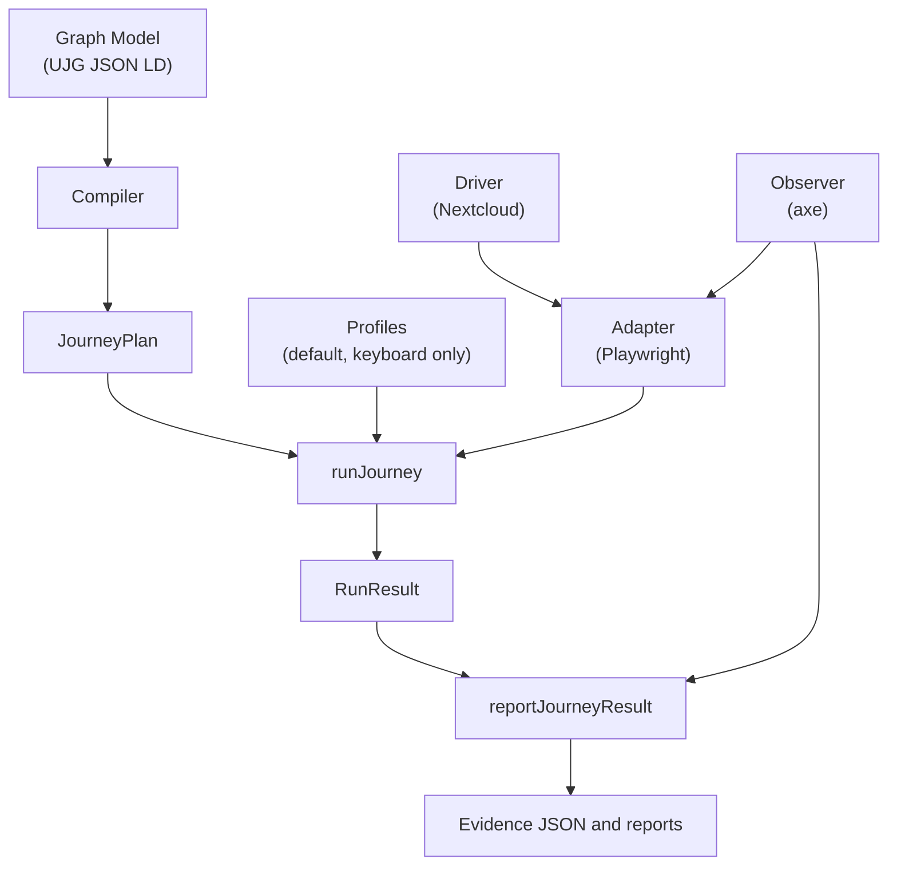

# journey-mesh

Model-driven execution and validation of cross-service user journeys, with pluggable model bindings, automation adapters, application drivers, interaction profiles, and evidence observers.

Links: [live demo](https://journey-mesh.openuji.org/#demo) · [roadmap](docs/roadmap.md) · [known-good accessibility report](https://journey-mesh.openuji.org/accessibility/filesharing/artifacts/nextcloud-filesharing.axe-path)

## Problem

Federated and multi-service systems can report that every service is healthy while the user journey is still broken at a boundary: account mapping, remote discovery, delayed delivery, upgrade compatibility, or evidence review. Journey Mesh makes the intended journey executable, then records evidence against the states and transitions in the model.

## Architecture

### Extension responsibilities

- Model bindings own model parsing, validation, source references, and execution-plan generation.
- Automation adapters own generic execution against an automation runtime such as Playwright.
- Application drivers own service-specific navigation, fixture setup, session isolation, and effect handling.
- Interaction profiles own input-modality selection such as default pointer-first and keyboard-only operation.
- Observers own evidence collection and redaction for functional, accessibility, reliability, and deployment signals.
- Reporters own versioned output formats, human-readable summaries, and CI-compatible artifacts.

## Available Today

- Generic runner, UJG binding, Playwright adapter, Nextcloud driver, default and keyboard-only profiles, and axe observer.
- A working Nextcloud federated file-sharing example with local stack scripts and CI artifact upload.
- Published demo and known-good report:
  [journey-mesh.openuji.org](https://journey-mesh.openuji.org/) and
  [nextcloud-filesharing.axe-path](https://journey-mesh.openuji.org/accessibility/filesharing/artifacts/nextcloud-filesharing.axe-path).

## Proposed Work

The proposed roadmap adds multipath-aware execution, stable extension contracts, Fediversity/Nix post-deployment and upgrade validation, expanded Nextcloud scenarios, a Mastodon driver, runtime reliability evidence, and improved reporting and documentation.

- [Technical roadmap](docs/roadmap.md)
- [Public roadmap issue](https://github.com/openuji/journey-mesh/issues/11)

The roadmap is proposed and is not a delivery commitment.

## Nextcloud Example

See [`examples/nextcloud-filesharing/README.md`](examples/nextcloud-filesharing/README.md) for the concise architecture flow, sample e2e output, and artifact links.

## Limitations

- Current execution compiles the checked-in UJG into a linear plan; ambiguous branches are rejected.
- The only application driver in this repository is the Nextcloud reference driver.
- The example requires a local Docker-based Nextcloud stack and `host.docker.internal` resolution.
- Accessibility evidence supports journey review, but it is not WCAG certification.
- Extension APIs and report formats are prototype contracts.
- Roadmap items are proposed work, not committed delivery.

## UJG Citation

The checked-in authoring model declares `ujgTarget: "1.0-rc1"` and the compiled JSON-LD model uses the UJG `1.0-rc1` context set. For the public community snapshot, cite the [UJG 1.0 Release Candidate 1](https://ujg.specs.openuji.org/tr/1.0-rc1), published 2026-07-27 by the [W3C User Journey Graph Community Group](https://www.w3.org/groups/cg/ujg/).

## Maintainers / Contact

Use [GitHub Issues](https://github.com/openuji/journey-mesh/issues) for bugs and focused technical feedback. Use the [public roadmap issue](https://github.com/openuji/journey-mesh/issues/11) for broad roadmap discussion.

## License

MIT. See [`LICENSE`](LICENSE).
