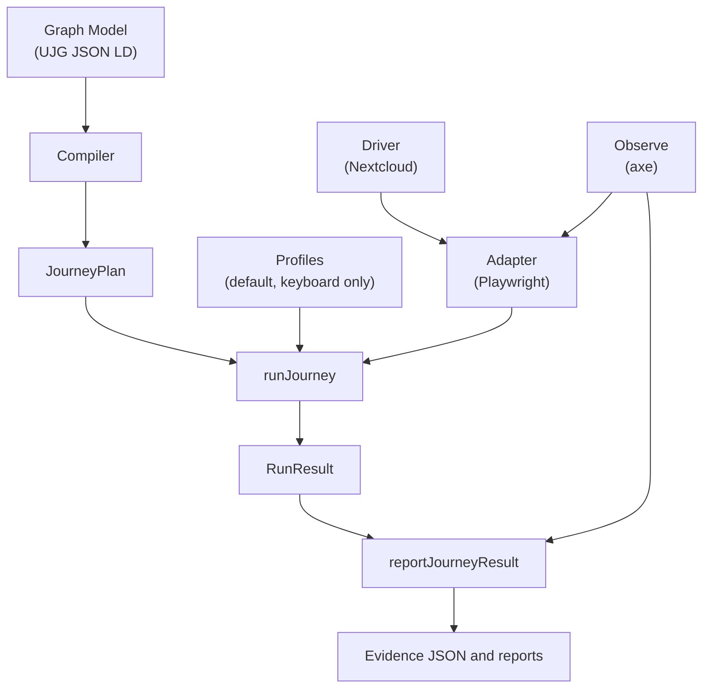

# journey-mesh

[](https://github.com/openuji/journey-mesh/actions/workflows/ci.yml)
[](https://github.com/openuji/journey-mesh/actions/workflows/example-ci.yml)

Model-driven execution and validation of cross-service user journeys, with pluggable model bindings, automation adapters, application drivers, interaction profiles, and evidence observers.

Links: [live demo](https://journey-mesh.openuji.org/) · [roadmap](docs/roadmap.md) · [known-good accessibility report](https://journey-mesh.openuji.org/accessibility/filesharing/artifacts/nextcloud-filesharing.axe-path)

## Problem

Federated and multi-service systems can report that every service is healthy while the user journey is still broken at a boundary: account mapping, remote discovery, delayed delivery, upgrade compatibility, or evidence review. Journey Mesh makes the intended journey executable, then records evidence against the states and transitions in the model.

## Fediversity Use Case

The reference Fediversity use case is federated file sharing between two Nextcloud instances. Alice shares `report.pdf` from Nextcloud A to Bob on Nextcloud B; Bob accepts the remote share and verifies that the file appears. This gives reviewers a concrete cross-instance workflow that exercises federation through real browser interactions, not only service APIs.

## Architecture

```text
UJG JSON-LD model
  -> compileUjgJourneyPlan(...)
  -> JourneyPlan
  -> runJourney(...)
       profiles: default, keyboard-only
       adapter: Playwright
         driver: Nextcloud
         observer: axe accessibility scans
  -> reportJourneyResult(...)
       evidence JSON + axe path report + Playwright summary
```

Diagram



Today this repository supports UJG as the model binding. The model-agnostic boundary is the compiled `JourneyPlan`; future bindings such as restricted Gherkin would compile to that same shape. In the reference example, `nextcloudDriver(...)` and `axeObserver(...)` are configured through `playwrightAdapter(...)`, matching [`run.ts`](examples/nextcloud-filesharing/run.ts).

## Available Today

- Generic runner, UJG binding, Playwright adapter, Nextcloud driver, default and keyboard-only profiles, and axe observer.
- A working Nextcloud federated file-sharing example with local stack scripts and CI artifact upload.
- Published demo and known-good report:
  [journey-mesh.openuji.org](https://journey-mesh.openuji.org/) and
  [nextcloud-filesharing.axe-path](https://journey-mesh.openuji.org/accessibility/filesharing/artifacts/nextcloud-filesharing.axe-path).

## Proposed Work

The proposed roadmap adds multipath-aware execution, stable extension contracts, Fediversity/Nix post-deployment and upgrade validation, expanded Nextcloud scenarios, a Mastodon driver, runtime reliability evidence, and improved reporting and documentation.

- [Technical roadmap](docs/roadmap.md)
- [Public roadmap issue](https://github.com/openuji/journey-mesh/issues/11)

The roadmap is proposed and is not a delivery commitment.

## Nextcloud Example

See [`examples/nextcloud-filesharing/README.md`](examples/nextcloud-filesharing/README.md) for the concise architecture flow, sample e2e output, and artifact links.

The Nextcloud file-sharing example owns its own scripts:

```bash
pnpm --filter @openuji/example-nextcloud-filesharing stack:up
pnpm --filter @openuji/example-nextcloud-filesharing stack:provision
pnpm --filter @openuji/example-nextcloud-filesharing stack:seed
pnpm --filter @openuji/example-nextcloud-filesharing e2e
pnpm --filter @openuji/example-nextcloud-filesharing e2e:report
```

The example loads `examples/nextcloud-filesharing/ujg/filesharing.ujg.jsonld`, configures the generic Playwright adapter and Nextcloud driver, runs `defaultProfile()` and `keyboardOnlyProfile()`, and attaches normalized evidence JSON to the Playwright test result. Set `UJG_EVIDENCE_STDOUT=1` to also print the full evidence JSON.

## Limitations

- Current execution compiles the checked-in UJG into a linear plan; ambiguous branches are rejected.
- The only application driver in this repository is the Nextcloud reference driver.
- The example requires a local Docker-based Nextcloud stack and `host.docker.internal` resolution.
- Accessibility evidence supports journey review, but it is not WCAG certification.
- Extension APIs and report formats are prototype contracts.
- Roadmap items are proposed work, not committed delivery.

## UJG Citation

The checked-in authoring model declares `ujgTarget: "1.0-rc1"` and the compiled JSON-LD model uses the UJG `1.0-rc1` context set. For the public community snapshot, cite the [UJG First Editors' Draft technical report](https://ujg.specs.openuji.org/tr/2026.06), published 2026-06-09 by the [W3C User Journey Graph Community Group](https://www.w3.org/groups/cg/ujg/).

## Maintainers / Contact

Use [GitHub Issues](https://github.com/openuji/journey-mesh/issues) for bugs and focused technical feedback. Use the [public roadmap issue](https://github.com/openuji/journey-mesh/issues/11) for broad roadmap discussion.

## License

MIT. See [`LICENSE`](LICENSE).
