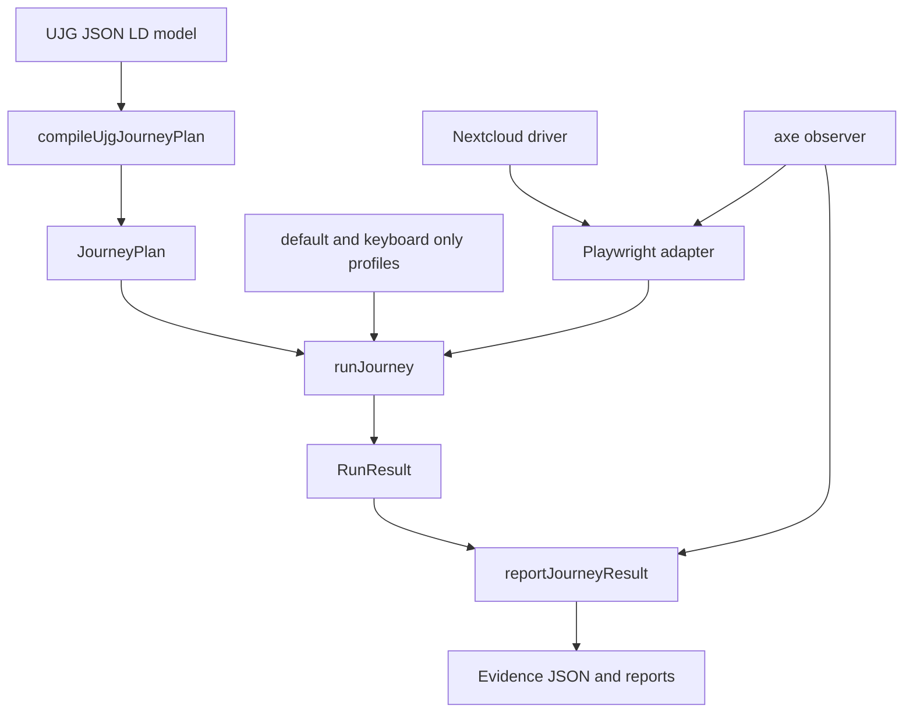

[](https://github.com/openuji/journey-mesh/actions/workflows/example-ci.yml)

# Nextcloud File-Sharing Example

This example runs a federated file-sharing journey between Alice and Bob from a UJG model, through Journey Mesh, into Playwright browser automation.

## Architecture


```text
ujg/filesharing.ujg.jsonld
  -> compileUjgJourneyPlan(...)
  -> JourneyPlan
  -> runJourney(...)
       profiles: default, keyboard-only
       adapter: Playwright
         driver: Nextcloud
         observer: axe accessibility scans
  -> reportJourneyResult(...)
       evidence JSON + axe path report + Playwright summary
```

Diagram



The entrypoint is [`run.ts`](./run.ts). It declares the runner first, then binds it to Playwright:

```ts
const runner = createNextcloudFilesharingRunner();

test("executes the federated file-sharing UJG journey", async ({ browser }, testInfo) => {
  const { result, reporting } = await runner.run({ browser: browser as Browser, testInfo });
});
```

## Run

Start and seed the local stack first:

See [`deployment/README.md`](./deployment/README.md) for stack details. Your host must resolve `host.docker.internal`; if it does not, add `127.0.0.1 host.docker.internal` to `/etc/hosts`.

```sh
pnpm  stack:up
pnpm  stack:provision
pnpm  stack:seed
```

Then run the journey:

```sh
pnpm  e2e
```

Representative output:

```text
Running 1 test using 1 worker
  1 passed

Commands
  report         pnpm --filter @openuji/example-nextcloud-filesharing e2e:report

UJG Journey PASS
  run      run-2026-07-30T...
  plan     urn:ujg:document:nextcloud-federated-sharing:plan:v1
  profiles 2/2 passed

Profiles
  default        ok
  keyboard-only  ok

Artifacts
  evidence       test-results/.../ujg-evidence.json
  axe html       test-results/.../nextcloud-filesharing.axe-path.html
  accessibility  test-results/.../axe-accessibility-nextcloud-filesharing.axe-path.json
```

## Evidence And Reports

Open the Playwright HTML report:

```sh
pnpm --filter @openuji/example-nextcloud-filesharing e2e:report
```

Main files produced under `examples/nextcloud-filesharing/`:

- `playwright-report/index.html`: Playwright report with attached evidence and axe artifacts.
- `test-results/.../ujg-evidence.json`: normalized Journey Mesh run evidence.
- `test-results/.../ujg-summary.json`: summary consumed by the custom console reporter.
- `test-results/.../nextcloud-filesharing.axe-path.html`: browsable axe path report.
- `test-results/.../axe-accessibility-nextcloud-filesharing.axe-path.json`: accessibility summary indexed by journey state/transition.

Set `UJG_EVIDENCE_STDOUT=1` to also print the full evidence JSON during `e2e`.
